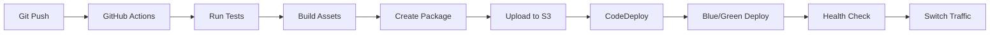

# AWS Deployment Plan for Innobic Procurement System
## Complete Infrastructure & Deployment Guide

---

## 📊 Executive Summary

### System Overview
- **Application:** Innobic Procurement Management System
- **Framework:** Laravel 11 + Filament 3
- **Database:** MySQL 8.0
- **Cache/Queue:** Redis
- **File Storage:** S3
- **Target Users:** 100-500 concurrent users
- **Expected Growth:** 30% annually

### Recommended AWS Architecture
- **Model:** High Availability Multi-AZ Setup
- **Environment:** Production, Staging, Development
- **Estimated Cost:** $300-500/month (Production)

---

## 🏗️ Architecture Overview

### Recommended Architecture: High Availability Setup

```
┌─────────────────────────────────────────────────────────────────┐
│                         Route 53 (DNS)                           │
└─────────────────────────────────────────────────────────────────┘
                                 │
                                 ▼
┌─────────────────────────────────────────────────────────────────┐
│                    CloudFront (CDN) - Optional                   │
└─────────────────────────────────────────────────────────────────┘
                                 │
                                 ▼
┌─────────────────────────────────────────────────────────────────┐
│              Application Load Balancer (ALB)                     │
│                    - SSL Termination                             │
│                    - Health Checks                               │
└─────────────────────────────────────────────────────────────────┘
                    │                        │
                    ▼                        ▼
        ┌─────────────────────┐  ┌─────────────────────┐
        │    EC2 Instance      │  │    EC2 Instance      │
        │   (Availability      │  │   (Availability      │
        │      Zone 1a)        │  │      Zone 1b)        │
        │                      │  │                      │
        │  - Nginx             │  │  - Nginx             │
        │  - PHP 8.2           │  │  - PHP 8.2           │
        │  - Laravel App       │  │  - Laravel App       │
        │  - Supervisor        │  │  - Supervisor        │
        └─────────────────────┘  └─────────────────────┘
                    │                        │
        ┌───────────┴────────────────────────┴───────────┐
        │                                                 │
        ▼                                                 ▼
┌─────────────────┐                          ┌─────────────────┐
│  RDS MySQL      │                          │  ElastiCache    │
│  (Multi-AZ)     │                          │  (Redis)        │
└─────────────────┘                          └─────────────────┘
        │                                                 
        ▼                                                 
┌─────────────────┐                          ┌─────────────────┐
│  S3 Bucket      │                          │  SES            │
│  (Files)        │                          │  (Email)        │
└─────────────────┘                          └─────────────────┘
```

---

## 🔧 AWS Services Configuration

### 1. VPC (Virtual Private Cloud)

```yaml
VPC Configuration:
  CIDR: 10.0.0.0/16
  Region: ap-southeast-1 (Singapore)
  
Subnets:
  Public:
    - public-subnet-1a: 10.0.1.0/24 (AZ: ap-southeast-1a)
    - public-subnet-1b: 10.0.2.0/24 (AZ: ap-southeast-1b)
  
  Private:
    - private-subnet-1a: 10.0.10.0/24 (AZ: ap-southeast-1a)
    - private-subnet-1b: 10.0.11.0/24 (AZ: ap-southeast-1b)
    - private-subnet-db-1a: 10.0.20.0/24 (AZ: ap-southeast-1a)
    - private-subnet-db-1b: 10.0.21.0/24 (AZ: ap-southeast-1b)

Internet Gateway: igw-innobic
NAT Gateway: 
  - nat-1a (for private-subnet-1a)
  - nat-1b (for private-subnet-1b)

Security Groups:
  - sg-alb: Port 80, 443 from 0.0.0.0/0
  - sg-web: Port 80 from sg-alb
  - sg-db: Port 3306 from sg-web
  - sg-redis: Port 6379 from sg-web
```

### 2. EC2 Instances

#### Production Environment
```yaml
Instance Type: t3.medium (Recommended)
  - vCPU: 2
  - Memory: 4 GB
  - Network: Up to 5 Gbps
  - Cost: ~$30/month per instance

Alternative Options:
  - Small: t3.small (2 vCPU, 2 GB RAM) - $15/month
  - Large: t3.large (2 vCPU, 8 GB RAM) - $60/month

AMI: Amazon Linux 2023 or Ubuntu 22.04 LTS

Auto Scaling Group:
  Min: 2
  Desired: 2
  Max: 6
  
Launch Template Configuration:
  - Instance Type: t3.medium
  - Key Pair: innobic-prod-key
  - Security Group: sg-web
  - IAM Role: innobic-ec2-role
  - User Data: (see bootstrap script below)
```

#### EC2 Bootstrap Script (User Data)
```bash
#!/bin/bash

# Update system
yum update -y

# Install required packages
yum install -y amazon-linux-extras
amazon-linux-extras install -y nginx1 php8.2

# Install PHP extensions
yum install -y \
    php-fpm \
    php-mysqlnd \
    php-opcache \
    php-xml \
    php-gd \
    php-mbstring \
    php-json \
    php-bcmath \
    php-zip \
    php-redis

# Install Composer
curl -sS https://getcomposer.org/installer | php
mv composer.phar /usr/local/bin/composer
chmod +x /usr/local/bin/composer

# Install Node.js
curl -sL https://rpm.nodesource.com/setup_18.x | bash -
yum install -y nodejs

# Install Supervisor
yum install -y supervisor

# Configure PHP-FPM
cat > /etc/php-fpm.d/www.conf << 'EOF'
[www]
user = nginx
group = nginx
listen = /var/run/php-fpm/www.sock
listen.owner = nginx
listen.group = nginx
listen.mode = 0660
pm = dynamic
pm.max_children = 50
pm.start_servers = 5
pm.min_spare_servers = 5
pm.max_spare_servers = 35
pm.max_requests = 500
EOF

# Configure Nginx
cat > /etc/nginx/conf.d/innobic.conf << 'EOF'
server {
    listen 80;
    server_name _;
    root /var/www/innobic/public;
    index index.php index.html;

    client_max_body_size 100M;

    location / {
        try_files $uri $uri/ /index.php?$query_string;
    }

    location ~ \.php$ {
        fastcgi_pass unix:/var/run/php-fpm/www.sock;
        fastcgi_index index.php;
        fastcgi_param SCRIPT_FILENAME $realpath_root$fastcgi_script_name;
        include fastcgi_params;
    }

    location ~ /\.(?!well-known).* {
        deny all;
    }
}
EOF

# Start services
systemctl enable nginx php-fpm supervisord
systemctl start nginx php-fpm supervisord

# Create application directory
mkdir -p /var/www/innobic
chown -R nginx:nginx /var/www/innobic

# Install CodeDeploy agent
yum install -y ruby wget
cd /home/ec2-user
wget https://aws-codedeploy-ap-southeast-1.s3.ap-southeast-1.amazonaws.com/latest/install
chmod +x ./install
./install auto
```

### 3. RDS (MySQL Database)

```yaml
Engine: MySQL 8.0.35
Instance Class: db.t3.medium
  - vCPU: 2
  - Memory: 4 GB
  - Cost: ~$60/month

Storage:
  Type: General Purpose SSD (gp3)
  Size: 100 GB
  IOPS: 3000
  Throughput: 125 MiB/s

High Availability:
  Multi-AZ: Yes
  Backup Retention: 7 days
  Backup Window: 03:00-04:00 UTC
  Maintenance Window: Sun 04:00-05:00 UTC

Security:
  Encryption: Yes (AWS KMS)
  Public Access: No
  Security Group: sg-db

Parameter Group Settings:
  max_connections: 200
  innodb_buffer_pool_size: 2684354560 (2.5GB)
  slow_query_log: 1
  long_query_time: 2
  general_log: 0
```

### 4. ElastiCache (Redis)

```yaml
Engine: Redis 7.0
Node Type: cache.t3.micro
  - Memory: 0.5 GB
  - Cost: ~$13/month

Cluster Mode: Disabled
Number of Nodes: 2 (Primary + Replica)
Availability Zones: Multi-AZ

Parameter Group Settings:
  maxmemory-policy: allkeys-lru
  timeout: 300
  tcp-keepalive: 60

Security:
  Encryption in Transit: Yes
  Encryption at Rest: Yes
  Security Group: sg-redis
```

### 5. S3 Bucket

```yaml
Bucket Name: innobic-files-prod
Region: ap-southeast-1

Versioning: Enabled
Encryption: AES-256

Lifecycle Rules:
  - Transition to IA after 90 days
  - Transition to Glacier after 365 days
  - Delete after 7 years

CORS Configuration:
  AllowedOrigins: ["https://yourdomain.com"]
  AllowedMethods: ["GET", "POST", "PUT", "DELETE"]
  AllowedHeaders: ["*"]
  MaxAgeSeconds: 3600

Bucket Policy:
  - Allow EC2 instances to read/write
  - Deny public access
  - Require HTTPS
```

### 6. Application Load Balancer (ALB)

```yaml
Name: innobic-alb-prod
Type: Application
Scheme: Internet-facing
IP Address Type: IPv4

Listeners:
  - Port 80 → Redirect to HTTPS
  - Port 443 → Forward to Target Group

Target Group:
  Name: innobic-tg-prod
  Protocol: HTTP
  Port: 80
  Target Type: Instance
  
  Health Check:
    Path: /health
    Interval: 30 seconds
    Timeout: 5 seconds
    Healthy Threshold: 2
    Unhealthy Threshold: 3

SSL Certificate:
  AWS Certificate Manager (ACM)
  Domain: yourdomain.com
  Validation: DNS
```

### 7. Route 53

```yaml
Hosted Zone: yourdomain.com

Record Sets:
  - Type: A
    Name: yourdomain.com
    Alias: innobic-alb-prod
    
  - Type: A
    Name: www.yourdomain.com
    Alias: innobic-alb-prod
    
  - Type: MX
    Name: yourdomain.com
    Value: AWS SES endpoints
```

### 8. SES (Simple Email Service)

```yaml
Domain: yourdomain.com
Region: ap-southeast-1

Configuration Sets:
  Name: innobic-config-set
  Reputation Tracking: Enabled
  Event Publishing: 
    - CloudWatch (Bounce, Complaint)
    - SNS (Delivery)

Sending Rate: 14 emails/second
Daily Quota: 50,000 emails
```

---

## 🚀 Deployment Process

### Step 1: Prepare AWS Account

```bash
# 1. Install AWS CLI
curl "https://awscli.amazonaws.com/awscli-exe-linux-x86_64.zip" -o "awscliv2.zip"
unzip awscliv2.zip
sudo ./aws/install

# 2. Configure AWS CLI
aws configure
# Enter: Access Key ID, Secret Access Key, Region (ap-southeast-1), Output format (json)

# 3. Create S3 bucket for deployment artifacts
aws s3 mb s3://innobic-deployment-artifacts --region ap-southeast-1
```

### Step 2: Infrastructure as Code (Terraform)

```hcl
# main.tf
terraform {
  required_providers {
    aws = {
      source  = "hashicorp/aws"
      version = "~> 5.0"
    }
  }
  
  backend "s3" {
    bucket = "innobic-terraform-state"
    key    = "prod/terraform.tfstate"
    region = "ap-southeast-1"
  }
}

provider "aws" {
  region = "ap-southeast-1"
}

# VPC Module
module "vpc" {
  source = "terraform-aws-modules/vpc/aws"
  
  name = "innobic-vpc"
  cidr = "10.0.0.0/16"
  
  azs             = ["ap-southeast-1a", "ap-southeast-1b"]
  private_subnets = ["10.0.10.0/24", "10.0.11.0/24"]
  public_subnets  = ["10.0.1.0/24", "10.0.2.0/24"]
  database_subnets = ["10.0.20.0/24", "10.0.21.0/24"]
  
  enable_nat_gateway = true
  enable_vpn_gateway = false
  enable_dns_hostnames = true
  enable_dns_support = true
  
  tags = {
    Environment = "production"
    Project     = "innobic"
  }
}

# Security Groups
resource "aws_security_group" "alb" {
  name_prefix = "innobic-alb-"
  vpc_id      = module.vpc.vpc_id
  
  ingress {
    from_port   = 80
    to_port     = 80
    protocol    = "tcp"
    cidr_blocks = ["0.0.0.0/0"]
  }
  
  ingress {
    from_port   = 443
    to_port     = 443
    protocol    = "tcp"
    cidr_blocks = ["0.0.0.0/0"]
  }
  
  egress {
    from_port   = 0
    to_port     = 0
    protocol    = "-1"
    cidr_blocks = ["0.0.0.0/0"]
  }
}

resource "aws_security_group" "web" {
  name_prefix = "innobic-web-"
  vpc_id      = module.vpc.vpc_id
  
  ingress {
    from_port       = 80
    to_port         = 80
    protocol        = "tcp"
    security_groups = [aws_security_group.alb.id]
  }
  
  egress {
    from_port   = 0
    to_port     = 0
    protocol    = "-1"
    cidr_blocks = ["0.0.0.0/0"]
  }
}

# RDS
resource "aws_db_instance" "mysql" {
  identifier     = "innobic-mysql-prod"
  engine         = "mysql"
  engine_version = "8.0.35"
  instance_class = "db.t3.medium"
  
  allocated_storage     = 100
  storage_type         = "gp3"
  storage_encrypted    = true
  
  db_name  = "innobic"
  username = "admin"
  password = var.db_password  # Store in AWS Secrets Manager
  
  vpc_security_group_ids = [aws_security_group.db.id]
  db_subnet_group_name   = aws_db_subnet_group.main.name
  
  backup_retention_period = 7
  backup_window          = "03:00-04:00"
  maintenance_window     = "sun:04:00-sun:05:00"
  
  multi_az               = true
  publicly_accessible    = false
  
  skip_final_snapshot    = false
  final_snapshot_identifier = "innobic-mysql-final-${timestamp()}"
  
  tags = {
    Name        = "innobic-mysql-prod"
    Environment = "production"
  }
}

# ElastiCache
resource "aws_elasticache_replication_group" "redis" {
  replication_group_id       = "innobic-redis-prod"
  replication_group_description = "Redis cluster for Innobic"
  
  engine               = "redis"
  node_type           = "cache.t3.micro"
  number_cache_clusters = 2
  port                = 6379
  
  subnet_group_name = aws_elasticache_subnet_group.main.name
  security_group_ids = [aws_security_group.redis.id]
  
  at_rest_encryption_enabled = true
  transit_encryption_enabled = true
  
  automatic_failover_enabled = true
  multi_az_enabled          = true
  
  snapshot_retention_limit = 5
  snapshot_window         = "03:00-05:00"
  
  tags = {
    Name        = "innobic-redis-prod"
    Environment = "production"
  }
}

# Auto Scaling Group
resource "aws_launch_template" "web" {
  name_prefix   = "innobic-web-"
  image_id      = data.aws_ami.amazon_linux_2023.id
  instance_type = "t3.medium"
  
  vpc_security_group_ids = [aws_security_group.web.id]
  
  iam_instance_profile {
    name = aws_iam_instance_profile.ec2.name
  }
  
  user_data = base64encode(file("user_data.sh"))
  
  tag_specifications {
    resource_type = "instance"
    tags = {
      Name        = "innobic-web"
      Environment = "production"
    }
  }
}

resource "aws_autoscaling_group" "web" {
  name               = "innobic-asg-prod"
  vpc_zone_identifier = module.vpc.private_subnets
  target_group_arns  = [aws_lb_target_group.web.arn]
  health_check_type  = "ELB"
  health_check_grace_period = 300
  
  min_size         = 2
  max_size         = 6
  desired_capacity = 2
  
  launch_template {
    id      = aws_launch_template.web.id
    version = "$Latest"
  }
  
  tag {
    key                 = "Name"
    value               = "innobic-web-asg"
    propagate_at_launch = true
  }
}

# Application Load Balancer
resource "aws_lb" "main" {
  name               = "innobic-alb-prod"
  internal           = false
  load_balancer_type = "application"
  security_groups    = [aws_security_group.alb.id]
  subnets           = module.vpc.public_subnets
  
  enable_deletion_protection = true
  enable_http2              = true
  
  tags = {
    Name        = "innobic-alb-prod"
    Environment = "production"
  }
}

resource "aws_lb_target_group" "web" {
  name     = "innobic-tg-prod"
  port     = 80
  protocol = "HTTP"
  vpc_id   = module.vpc.vpc_id
  
  health_check {
    enabled             = true
    healthy_threshold   = 2
    unhealthy_threshold = 3
    timeout             = 5
    interval            = 30
    path                = "/health"
    matcher             = "200"
  }
}

resource "aws_lb_listener" "http" {
  load_balancer_arn = aws_lb.main.arn
  port              = "80"
  protocol          = "HTTP"
  
  default_action {
    type = "redirect"
    redirect {
      port        = "443"
      protocol    = "HTTPS"
      status_code = "HTTP_301"
    }
  }
}

resource "aws_lb_listener" "https" {
  load_balancer_arn = aws_lb.main.arn
  port              = "443"
  protocol          = "HTTPS"
  ssl_policy        = "ELBSecurityPolicy-TLS-1-2-2017-01"
  certificate_arn   = aws_acm_certificate.main.arn
  
  default_action {
    type             = "forward"
    target_group_arn = aws_lb_target_group.web.arn
  }
}
```

### Step 3: Application Deployment (GitHub Actions)

```yaml
# .github/workflows/deploy.yml
name: Deploy to AWS

on:
  push:
    branches: [main]
  workflow_dispatch:

env:
  AWS_REGION: ap-southeast-1
  ECR_REPOSITORY: innobic-app
  ECS_SERVICE: innobic-service
  ECS_CLUSTER: innobic-cluster

jobs:
  test:
    runs-on: ubuntu-latest
    steps:
      - uses: actions/checkout@v3
      
      - name: Setup PHP
        uses: shivammathur/setup-php@v2
        with:
          php-version: '8.2'
          extensions: mbstring, xml, bcmath, mysql
          
      - name: Install dependencies
        run: |
          composer install --no-interaction --prefer-dist
          npm ci
          
      - name: Run tests
        run: |
          php artisan test
          npm run test
          
  build:
    needs: test
    runs-on: ubuntu-latest
    steps:
      - uses: actions/checkout@v3
      
      - name: Configure AWS credentials
        uses: aws-actions/configure-aws-credentials@v2
        with:
          aws-access-key-id: ${{ secrets.AWS_ACCESS_KEY_ID }}
          aws-secret-access-key: ${{ secrets.AWS_SECRET_ACCESS_KEY }}
          aws-region: ${{ env.AWS_REGION }}
          
      - name: Build application
        run: |
          composer install --no-dev --optimize-autoloader
          npm ci
          npm run build
          php artisan config:cache
          php artisan route:cache
          php artisan view:cache
          
      - name: Create deployment package
        run: |
          zip -r deploy.zip . -x "*.git*" "node_modules/*" "tests/*" "*.env.example"
          
      - name: Upload to S3
        run: |
          aws s3 cp deploy.zip s3://innobic-deployments/releases/$(date +%Y%m%d%H%M%S).zip
          
  deploy:
    needs: build
    runs-on: ubuntu-latest
    steps:
      - name: Deploy to EC2 instances
        run: |
          aws codedeploy create-deployment \
            --application-name innobic-app \
            --deployment-group-name production \
            --s3-location bucket=innobic-deployments,key=releases/latest.zip,bundleType=zip \
            --region ${{ env.AWS_REGION }}
```

### Step 4: CodeDeploy Configuration

```yaml
# appspec.yml
version: 0.0
os: linux

files:
  - source: /
    destination: /var/www/innobic

hooks:
  BeforeInstall:
    - location: scripts/install_dependencies.sh
      timeout: 300
      runas: root
      
  ApplicationStart:
    - location: scripts/start_application.sh
      timeout: 300
      runas: root
      
  ApplicationStop:
    - location: scripts/stop_application.sh
      timeout: 300
      runas: root
      
  ValidateService:
    - location: scripts/validate_service.sh
      timeout: 300
      runas: root
```

```bash
# scripts/install_dependencies.sh
#!/bin/bash
cd /var/www/innobic
composer install --no-dev --optimize-autoloader
npm ci
npm run build
```

```bash
# scripts/start_application.sh
#!/bin/bash
cd /var/www/innobic

# Run migrations
php artisan migrate --force

# Clear and cache configs
php artisan config:cache
php artisan route:cache
php artisan view:cache

# Restart services
systemctl restart php-fpm
systemctl restart nginx
systemctl restart supervisord

# Start queue workers
php artisan queue:restart
```

```bash
# scripts/validate_service.sh
#!/bin/bash
curl -f http://localhost/health || exit 1
```

---

## 💰 Cost Optimization

### Estimated Monthly Costs

#### Production Environment
```
EC2 (2x t3.medium):           $60
RDS (db.t3.medium Multi-AZ):  $120
ElastiCache (2x t3.micro):    $26
ALB:                          $25
S3 (100GB):                   $3
Data Transfer (100GB):        $9
Route 53:                     $1
CloudWatch:                   $10
Backup Storage:               $5
-----------------------------------
Total:                        ~$259/month
```

#### Cost Saving Options

1. **Reserved Instances (1-year commitment)**
   - EC2: Save 30-40%
   - RDS: Save 30-40%
   - ElastiCache: Save 30-40%
   - Potential savings: $80-100/month

2. **Spot Instances (for non-critical workloads)**
   - Development/Testing: Up to 90% savings
   - Batch processing: Up to 70% savings

3. **Auto Scaling Optimization**
   ```yaml
   Schedule-based scaling:
     - Scale down at night (8 PM - 8 AM): Min 1 instance
     - Scale up during business hours: Min 2 instances
     - Weekend scaling: Min 1 instance
   ```

4. **S3 Lifecycle Policies**
   ```yaml
   - Infrequent Access after 30 days: Save 40%
   - Glacier after 90 days: Save 80%
   - Delete old logs after 1 year
   ```

---

## 🔒 Security Best Practices

### 1. IAM Roles and Policies

```json
{
  "Version": "2012-10-17",
  "Statement": [
    {
      "Effect": "Allow",
      "Action": [
        "s3:GetObject",
        "s3:PutObject",
        "s3:DeleteObject"
      ],
      "Resource": "arn:aws:s3:::innobic-files-prod/*"
    },
    {
      "Effect": "Allow",
      "Action": [
        "ses:SendEmail",
        "ses:SendRawEmail"
      ],
      "Resource": "*"
    },
    {
      "Effect": "Allow",
      "Action": [
        "secretsmanager:GetSecretValue"
      ],
      "Resource": "arn:aws:secretsmanager:*:*:secret:innobic/*"
    }
  ]
}
```

### 2. Secrets Management

```bash
# Store sensitive data in AWS Secrets Manager
aws secretsmanager create-secret \
  --name innobic/prod/database \
  --secret-string '{"username":"admin","password":"your-secure-password"}'

aws secretsmanager create-secret \
  --name innobic/prod/app-key \
  --secret-string '{"key":"base64:your-laravel-app-key"}'
```

### 3. Network Security

```yaml
WAF Rules:
  - SQL Injection Protection
  - XSS Protection
  - Rate Limiting (1000 req/5min per IP)
  - Geographic Restrictions (optional)
  - IP Whitelist for Admin Panel

Security Headers:
  - X-Frame-Options: DENY
  - X-Content-Type-Options: nosniff
  - X-XSS-Protection: 1; mode=block
  - Strict-Transport-Security: max-age=31536000
  - Content-Security-Policy: default-src 'self'
```

### 4. Backup Strategy

```yaml
RDS Automated Backups:
  - Daily snapshots
  - 7-day retention
  - Point-in-time recovery

Manual Backups:
  - Weekly full backup to S3
  - Monthly archive to Glacier
  - Cross-region replication for DR

Application Backups:
  - Daily code backup to S3
  - Configuration files versioning
  - Document storage sync to S3
```

---

## 📊 Monitoring & Alerting

### CloudWatch Dashboards

```yaml
Metrics to Monitor:
  Application:
    - Request count
    - Response time (P50, P90, P99)
    - Error rate (4xx, 5xx)
    - Active users
    
  Infrastructure:
    - CPU utilization
    - Memory usage
    - Disk I/O
    - Network throughput
    
  Database:
    - Connection count
    - Query performance
    - Replication lag
    - Storage usage
    
  Business:
    - User registrations
    - Purchase orders created
    - System errors
    - Email bounce rate
```

### CloudWatch Alarms

```yaml
Critical Alarms:
  - CPU > 80% for 5 minutes
  - Memory > 90% for 5 minutes
  - Disk usage > 85%
  - Database connections > 180
  - Error rate > 1%
  - Response time > 3 seconds
  
Actions:
  - Send SNS notification
  - Auto-scale trigger
  - Create incident in PagerDuty
  - Slack notification
```

### Application Performance Monitoring

```bash
# Install New Relic Agent
sudo rpm -Uvh https://yum.newrelic.com/pub/newrelic/el5/x86_64/newrelic-repo-5-3.noarch.rpm
sudo yum install -y newrelic-php5
newrelic-install install

# Configure Laravel for New Relic
# config/newrelic.php
return [
    'app_name' => env('NEW_RELIC_APP_NAME', 'Innobic'),
    'license' => env('NEW_RELIC_LICENSE_KEY'),
    'logging' => [
        'level' => env('NEW_RELIC_LOG_LEVEL', 'info'),
    ],
];
```

---

## 🔄 CI/CD Pipeline

### Complete Pipeline Flow



### Blue/Green Deployment

```yaml
Deployment Strategy:
  1. Deploy to Green environment
  2. Run smoke tests
  3. Gradually shift traffic (10% → 50% → 100%)
  4. Monitor for errors
  5. Rollback if needed
  
Traffic Shifting:
  - Linear10PercentEvery10Minutes
  - Canary10Percent30Minutes
  - AllAtOnce (for emergencies)
```

---

## 🚨 Disaster Recovery

### RTO and RPO Targets

```yaml
RTO (Recovery Time Objective): 4 hours
RPO (Recovery Point Objective): 1 hour

Backup Strategy:
  - Database: Continuous replication to standby region
  - Files: Cross-region S3 replication
  - Code: Multi-region Git repositories
  - Configuration: Stored in Parameter Store
```

### DR Procedures

```bash
# 1. Database Failover
aws rds failover-db-cluster \
  --db-cluster-identifier innobic-cluster

# 2. DNS Failover
aws route53 update-health-check \
  --health-check-id xxx \
  --resource-path /health

# 3. Scale up standby region
aws autoscaling set-desired-capacity \
  --auto-scaling-group-name innobic-asg-dr \
  --desired-capacity 4

# 4. Verify services
./scripts/dr-validation.sh
```

---

## 📝 Environment Variables

### Production .env Configuration

```env
# Application
APP_NAME=Innobic
APP_ENV=production
APP_KEY=${SSM:/innobic/prod/app-key}
APP_DEBUG=false
APP_URL=https://yourdomain.com

# Database
DB_CONNECTION=mysql
DB_HOST=${SSM:/innobic/prod/db-host}
DB_PORT=3306
DB_DATABASE=innobic
DB_USERNAME=${SSM:/innobic/prod/db-username}
DB_PASSWORD=${SSM:/innobic/prod/db-password}

# Cache & Session
CACHE_DRIVER=redis
SESSION_DRIVER=redis
QUEUE_CONNECTION=redis

# Redis
REDIS_HOST=${SSM:/innobic/prod/redis-host}
REDIS_PASSWORD=${SSM:/innobic/prod/redis-password}
REDIS_PORT=6379

# Mail
MAIL_MAILER=ses
MAIL_HOST=email-smtp.ap-southeast-1.amazonaws.com
MAIL_PORT=587
MAIL_USERNAME=${SSM:/innobic/prod/ses-username}
MAIL_PASSWORD=${SSM:/innobic/prod/ses-password}
MAIL_ENCRYPTION=tls
MAIL_FROM_ADDRESS=noreply@yourdomain.com

# AWS
AWS_ACCESS_KEY_ID=${SSM:/innobic/prod/aws-key}
AWS_SECRET_ACCESS_KEY=${SSM:/innobic/prod/aws-secret}
AWS_DEFAULT_REGION=ap-southeast-1
AWS_BUCKET=innobic-files-prod

# Pusher (Optional for real-time)
BROADCAST_DRIVER=pusher
PUSHER_APP_ID=${SSM:/innobic/prod/pusher-app-id}
PUSHER_APP_KEY=${SSM:/innobic/prod/pusher-key}
PUSHER_APP_SECRET=${SSM:/innobic/prod/pusher-secret}
PUSHER_APP_CLUSTER=ap1
```

---

## 🗂️ Maintenance Tasks

### Daily Tasks
```bash
# Check application health
curl https://yourdomain.com/health

# Check queue status
php artisan queue:monitor

# Check failed jobs
php artisan queue:failed
```

### Weekly Tasks
```bash
# Update packages
composer update --no-dev
npm update

# Clear old logs
find /var/log -name "*.log" -mtime +7 -delete

# Database optimization
mysqlcheck -o innobic -u admin -p
```

### Monthly Tasks
```bash
# Security patches
yum update -y --security

# SSL certificate check
openssl x509 -in /etc/ssl/certs/innobic.crt -noout -dates

# Capacity planning review
aws cloudwatch get-metric-statistics \
  --namespace AWS/EC2 \
  --metric-name CPUUtilization \
  --start-time 2024-01-01T00:00:00Z \
  --end-time 2024-01-31T23:59:59Z \
  --period 86400 \
  --statistics Average \
  --dimensions Name=AutoScalingGroupName,Value=innobic-asg
```

---

## 🎯 Performance Optimization

### Laravel Optimization

```bash
# Production optimizations
php artisan config:cache
php artisan route:cache
php artisan view:cache
php artisan event:cache
php artisan optimize

# OPcache configuration
opcache.enable=1
opcache.memory_consumption=256
opcache.max_accelerated_files=20000
opcache.validate_timestamps=0
opcache.revalidate_freq=0
```

### Database Optimization

```sql
-- Add indexes for common queries
CREATE INDEX idx_pr_status ON purchase_requisitions(status);
CREATE INDEX idx_pr_created ON purchase_requisitions(created_at);
CREATE INDEX idx_po_vendor ON purchase_orders(vendor_id);
CREATE INDEX idx_user_dept ON users(department_id);

-- Optimize tables
OPTIMIZE TABLE purchase_requisitions;
OPTIMIZE TABLE purchase_orders;
```

### CDN Configuration

```yaml
CloudFront Distribution:
  Origins:
    - ALB: yourdomain.com
    - S3: innobic-files-prod.s3.amazonaws.com
    
  Behaviors:
    /api/*: No cache
    /admin/*: No cache
    /css/*: Cache 1 year
    /js/*: Cache 1 year
    /images/*: Cache 1 month
    
  Compress: Yes
  HTTP/2: Enabled
  Price Class: Use All Edge Locations
```

---

## 📋 Deployment Checklist

### Pre-Deployment
- [ ] Backup current production
- [ ] Test deployment in staging
- [ ] Review security groups
- [ ] Update environment variables
- [ ] Check SSL certificates
- [ ] Verify IAM roles
- [ ] Test database connection
- [ ] Configure monitoring alerts

### Deployment
- [ ] Deploy infrastructure (Terraform)
- [ ] Configure load balancer
- [ ] Deploy application code
- [ ] Run database migrations
- [ ] Verify health checks
- [ ] Test email sending
- [ ] Check file uploads
- [ ] Verify queue processing

### Post-Deployment
- [ ] Monitor error logs
- [ ] Check performance metrics
- [ ] Verify backups
- [ ] Test failover
- [ ] Update documentation
- [ ] Notify stakeholders
- [ ] Schedule load testing
- [ ] Plan first maintenance window

---

## 🆘 Troubleshooting Guide

### Common Issues and Solutions

#### 1. High CPU Usage
```bash
# Check top processes
top -c

# Check PHP-FPM processes
ps aux | grep php-fpm

# Check slow queries
mysql -e "SHOW PROCESSLIST"

# Solution: Scale up instances or optimize code
```

#### 2. Database Connection Errors
```bash
# Check connection count
mysql -e "SHOW STATUS LIKE 'Threads_connected'"

# Check max connections
mysql -e "SHOW VARIABLES LIKE 'max_connections'"

# Solution: Increase max_connections or add read replicas
```

#### 3. Memory Issues
```bash
# Check memory usage
free -h

# Check PHP memory limit
php -i | grep memory_limit

# Check OPcache usage
php -r "print_r(opcache_get_status());"

# Solution: Increase instance size or optimize memory usage
```

#### 4. Slow Response Times
```bash
# Enable slow query log
SET GLOBAL slow_query_log = 1;
SET GLOBAL long_query_time = 2;

# Check Laravel debug bar
composer require barryvdh/laravel-debugbar --dev

# Use New Relic APM for detailed analysis
```

---

## 📚 Additional Resources

### AWS Documentation
- [EC2 Best Practices](https://docs.aws.amazon.com/AWSEC2/latest/UserGuide/ec2-best-practices.html)
- [RDS Best Practices](https://docs.aws.amazon.com/AmazonRDS/latest/UserGuide/CHAP_BestPractices.html)
- [Well-Architected Framework](https://aws.amazon.com/architecture/well-architected/)

### Laravel on AWS
- [Laravel Vapor](https://vapor.laravel.com/) (Serverless option)
- [Laravel Forge](https://forge.laravel.com/) (Server management)
- [Laravel Envoyer](https://envoyer.io/) (Zero-downtime deployment)

### Monitoring Tools
- [New Relic](https://newrelic.com/)
- [Datadog](https://www.datadoghq.com/)
- [Sentry](https://sentry.io/) (Error tracking)

---

## 📞 Support Contacts

### AWS Support
- **Business Support:** $100/month
- **Enterprise Support:** 3% of monthly AWS spend
- **24/7 Phone Support:** Available with Business/Enterprise

### Escalation Matrix
1. **Level 1:** DevOps Team
2. **Level 2:** AWS Support
3. **Level 3:** AWS Technical Account Manager (TAM)

---

## 📅 Implementation Timeline

### Week 1: Foundation
- Day 1-2: AWS account setup, IAM configuration
- Day 3-4: VPC and networking setup
- Day 5: Security groups and NACLs

### Week 2: Core Infrastructure
- Day 1-2: RDS setup and configuration
- Day 3: ElastiCache setup
- Day 4: S3 and CloudFront
- Day 5: Testing and validation

### Week 3: Application Deployment
- Day 1-2: EC2 instances and Auto Scaling
- Day 3: Load balancer configuration
- Day 4: Application deployment
- Day 5: Testing and optimization

### Week 4: Production Readiness
- Day 1: Monitoring and alerting
- Day 2: Backup verification
- Day 3: Security audit
- Day 4: Performance testing
- Day 5: Go-live

---

*Document Version: 1.0*
*Last Updated: December 2024*
*Author: Innobic DevOps Team*

---

## 📝 Notes

This deployment plan is designed for a medium-scale production environment. Adjust resources based on your specific requirements and traffic patterns. Always test in a staging environment before deploying to production.

For questions or clarifications, please contact the DevOps team.