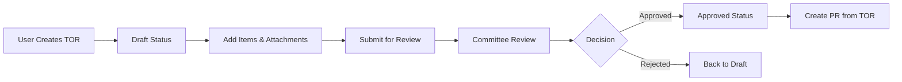

# แผนการพัฒนาระบบ TOR (Terms of Reference)
## สำหรับ Innobic Procurement System

---

## 📋 ภาพรวมระบบ TOR

### วัตถุประสงค์
TOR (Terms of Reference / ขอบเขตของงาน) เป็นเอกสารกำหนดรายละเอียดและขอบเขตของงานที่ต้องการจัดซื้อจัดจ้าง ใช้เป็นเอกสารอ้างอิงในการสร้าง Purchase Requisition (PR) สำหรับงานที่มีความซับซ้อนหรือมูลค่าสูง

### ตำแหน่งใน Procurement Flow
```
[TOR] → [PR] → [Value Analysis] → [PO] → [GR] → [Payment]
  ↑
(NEW)
```

---

## 🗄️ Database Structure

### 1. Main Table: `terms_of_references`

```sql
CREATE TABLE terms_of_references (
    id BIGINT UNSIGNED AUTO_INCREMENT PRIMARY KEY,
    tor_number VARCHAR(50) UNIQUE NOT NULL, -- Format: TOR-YYYY-XXXX
    company_id BIGINT UNSIGNED NOT NULL,
    department_id BIGINT UNSIGNED NOT NULL,
    
    -- Basic Information
    title VARCHAR(500) NOT NULL,
    project_name VARCHAR(500),
    project_code VARCHAR(100),
    tor_type ENUM('goods', 'services', 'construction', 'consulting') DEFAULT 'services',
    
    -- Content Fields
    background TEXT,
    objectives TEXT,
    scope_of_work TEXT NOT NULL,
    deliverables TEXT,
    specifications TEXT,
    
    -- Timeline & Budget
    start_date DATE,
    end_date DATE,
    duration_days INT,
    budget_estimate DECIMAL(15,2),
    currency VARCHAR(3) DEFAULT 'THB',
    
    -- Requirements
    qualification_requirements TEXT,
    evaluation_criteria TEXT,
    payment_terms TEXT,
    warranty_requirements TEXT,
    
    -- Workflow
    status ENUM('draft', 'reviewing', 'approved', 'rejected', 'cancelled', 'expired') DEFAULT 'draft',
    priority ENUM('low', 'medium', 'high', 'urgent') DEFAULT 'medium',
    
    -- Approval Tracking
    submitted_at TIMESTAMP NULL,
    submitted_by BIGINT UNSIGNED NULL,
    approved_at TIMESTAMP NULL,
    approved_by BIGINT UNSIGNED NULL,
    rejected_at TIMESTAMP NULL,
    rejected_by BIGINT UNSIGNED NULL,
    rejection_reason TEXT,
    
    -- Metadata
    created_by BIGINT UNSIGNED NOT NULL,
    updated_by BIGINT UNSIGNED NULL,
    created_at TIMESTAMP DEFAULT CURRENT_TIMESTAMP,
    updated_at TIMESTAMP DEFAULT CURRENT_TIMESTAMP ON UPDATE CURRENT_TIMESTAMP,
    deleted_at TIMESTAMP NULL,
    
    -- Foreign Keys
    FOREIGN KEY (company_id) REFERENCES companies(id),
    FOREIGN KEY (department_id) REFERENCES departments(id),
    FOREIGN KEY (created_by) REFERENCES users(id),
    FOREIGN KEY (approved_by) REFERENCES users(id),
    FOREIGN KEY (rejected_by) REFERENCES users(id),
    
    -- Indexes
    INDEX idx_tor_number (tor_number),
    INDEX idx_status (status),
    INDEX idx_department (department_id),
    INDEX idx_created_date (created_at)
);
```

### 2. TOR Items Table: `tor_items`

```sql
CREATE TABLE tor_items (
    id BIGINT UNSIGNED AUTO_INCREMENT PRIMARY KEY,
    tor_id BIGINT UNSIGNED NOT NULL,
    
    -- Item Details
    item_number INT NOT NULL,
    description TEXT NOT NULL,
    specifications TEXT,
    quantity DECIMAL(10,2) NOT NULL,
    unit_of_measure VARCHAR(50),
    estimated_unit_price DECIMAL(15,2),
    estimated_total_price DECIMAL(15,2),
    
    -- Additional Info
    delivery_location VARCHAR(500),
    required_date DATE,
    remarks TEXT,
    
    -- Metadata
    created_at TIMESTAMP DEFAULT CURRENT_TIMESTAMP,
    updated_at TIMESTAMP DEFAULT CURRENT_TIMESTAMP ON UPDATE CURRENT_TIMESTAMP,
    
    -- Foreign Keys
    FOREIGN KEY (tor_id) REFERENCES terms_of_references(id) ON DELETE CASCADE,
    
    -- Indexes
    INDEX idx_tor_items (tor_id)
);
```

### 3. TOR Attachments Table: `tor_attachments`

```sql
CREATE TABLE tor_attachments (
    id BIGINT UNSIGNED AUTO_INCREMENT PRIMARY KEY,
    tor_id BIGINT UNSIGNED NOT NULL,
    
    -- File Information
    file_name VARCHAR(255) NOT NULL,
    file_path VARCHAR(500) NOT NULL,
    file_type VARCHAR(100),
    file_size INT,
    mime_type VARCHAR(100),
    
    -- Document Type
    document_type ENUM('specification', 'drawing', 'reference', 'template', 'other') DEFAULT 'other',
    description TEXT,
    
    -- Metadata
    uploaded_by BIGINT UNSIGNED NOT NULL,
    uploaded_at TIMESTAMP DEFAULT CURRENT_TIMESTAMP,
    
    -- Foreign Keys
    FOREIGN KEY (tor_id) REFERENCES terms_of_references(id) ON DELETE CASCADE,
    FOREIGN KEY (uploaded_by) REFERENCES users(id),
    
    -- Indexes
    INDEX idx_tor_attachments (tor_id)
);
```

### 4. TOR Committee Members Table: `tor_committee_members`

```sql
CREATE TABLE tor_committee_members (
    id BIGINT UNSIGNED AUTO_INCREMENT PRIMARY KEY,
    tor_id BIGINT UNSIGNED NOT NULL,
    user_id BIGINT UNSIGNED NOT NULL,
    
    -- Role in Committee
    role ENUM('chairman', 'secretary', 'member', 'advisor') DEFAULT 'member',
    responsibilities TEXT,
    
    -- Approval Status
    has_reviewed BOOLEAN DEFAULT FALSE,
    reviewed_at TIMESTAMP NULL,
    review_notes TEXT,
    approval_status ENUM('pending', 'approved', 'rejected') DEFAULT 'pending',
    
    -- Metadata
    assigned_at TIMESTAMP DEFAULT CURRENT_TIMESTAMP,
    assigned_by BIGINT UNSIGNED NOT NULL,
    
    -- Foreign Keys
    FOREIGN KEY (tor_id) REFERENCES terms_of_references(id) ON DELETE CASCADE,
    FOREIGN KEY (user_id) REFERENCES users(id),
    FOREIGN KEY (assigned_by) REFERENCES users(id),
    
    -- Indexes
    UNIQUE KEY unique_tor_member (tor_id, user_id),
    INDEX idx_tor_committee (tor_id)
);
```

### 5. TOR Approval History Table: `tor_approval_history`

```sql
CREATE TABLE tor_approval_history (
    id BIGINT UNSIGNED AUTO_INCREMENT PRIMARY KEY,
    tor_id BIGINT UNSIGNED NOT NULL,
    
    -- Action Details
    action ENUM('submitted', 'reviewed', 'approved', 'rejected', 'returned', 'cancelled') NOT NULL,
    performed_by BIGINT UNSIGNED NOT NULL,
    performed_at TIMESTAMP DEFAULT CURRENT_TIMESTAMP,
    
    -- Status Transition
    from_status VARCHAR(50),
    to_status VARCHAR(50),
    
    -- Comments
    comments TEXT,
    
    -- Foreign Keys
    FOREIGN KEY (tor_id) REFERENCES terms_of_references(id) ON DELETE CASCADE,
    FOREIGN KEY (performed_by) REFERENCES users(id),
    
    -- Indexes
    INDEX idx_tor_history (tor_id, performed_at)
);
```

### 6. Update Purchase Requisitions Table

```sql
ALTER TABLE purchase_requisitions
ADD COLUMN tor_id BIGINT UNSIGNED NULL AFTER pr_number,
ADD FOREIGN KEY (tor_id) REFERENCES terms_of_references(id);

-- Add index for faster queries
CREATE INDEX idx_pr_tor ON purchase_requisitions(tor_id);
```

---

## 🔗 Model Relationships

### TOR Model (`app/Models/TermsOfReference.php`)

```php
<?php

namespace App\Models;

use Illuminate\Database\Eloquent\Model;
use Illuminate\Database\Eloquent\SoftDeletes;
use Illuminate\Database\Eloquent\Relations\HasMany;
use Illuminate\Database\Eloquent\Relations\BelongsTo;
use Illuminate\Database\Eloquent\Relations\BelongsToMany;

class TermsOfReference extends Model
{
    use SoftDeletes;

    protected $fillable = [
        'tor_number', 'company_id', 'department_id', 'title',
        'project_name', 'project_code', 'tor_type', 'background',
        'objectives', 'scope_of_work', 'deliverables', 'specifications',
        'start_date', 'end_date', 'duration_days', 'budget_estimate',
        'currency', 'qualification_requirements', 'evaluation_criteria',
        'payment_terms', 'warranty_requirements', 'status', 'priority',
        'submitted_at', 'submitted_by', 'approved_at', 'approved_by',
        'rejected_at', 'rejected_by', 'rejection_reason', 'created_by',
        'updated_by'
    ];

    protected $casts = [
        'start_date' => 'date',
        'end_date' => 'date',
        'submitted_at' => 'datetime',
        'approved_at' => 'datetime',
        'rejected_at' => 'datetime',
        'budget_estimate' => 'decimal:2',
    ];

    // Relationships
    public function company(): BelongsTo
    {
        return $this->belongsTo(Company::class);
    }

    public function department(): BelongsTo
    {
        return $this->belongsTo(Department::class);
    }

    public function creator(): BelongsTo
    {
        return $this->belongsTo(User::class, 'created_by');
    }

    public function approver(): BelongsTo
    {
        return $this->belongsTo(User::class, 'approved_by');
    }

    public function items(): HasMany
    {
        return $this->hasMany(TorItem::class, 'tor_id');
    }

    public function attachments(): HasMany
    {
        return $this->hasMany(TorAttachment::class, 'tor_id');
    }

    public function committeeMembers(): HasMany
    {
        return $this->hasMany(TorCommitteeMember::class, 'tor_id');
    }

    public function purchaseRequisitions(): HasMany
    {
        return $this->hasMany(PurchaseRequisition::class, 'tor_id');
    }

    public function approvalHistory(): HasMany
    {
        return $this->hasMany(TorApprovalHistory::class, 'tor_id');
    }

    // Scopes
    public function scopeApproved($query)
    {
        return $query->where('status', 'approved');
    }

    public function scopePending($query)
    {
        return $query->where('status', 'reviewing');
    }

    // Methods
    public static function generateTorNumber(): string
    {
        $year = date('Y');
        $lastTor = self::whereYear('created_at', $year)
            ->orderBy('id', 'desc')
            ->first();
        
        $sequence = $lastTor ? intval(substr($lastTor->tor_number, -4)) + 1 : 1;
        
        return sprintf('TOR-%s-%04d', $year, $sequence);
    }

    public function approve(User $approver): void
    {
        $this->update([
            'status' => 'approved',
            'approved_by' => $approver->id,
            'approved_at' => now(),
        ]);

        $this->recordHistory('approved', $approver);
    }

    public function reject(User $rejector, string $reason): void
    {
        $this->update([
            'status' => 'rejected',
            'rejected_by' => $rejector->id,
            'rejected_at' => now(),
            'rejection_reason' => $reason,
        ]);

        $this->recordHistory('rejected', $rejector, $reason);
    }

    protected function recordHistory(string $action, User $user, ?string $comments = null): void
    {
        $this->approvalHistory()->create([
            'action' => $action,
            'performed_by' => $user->id,
            'from_status' => $this->getOriginal('status'),
            'to_status' => $this->status,
            'comments' => $comments,
        ]);
    }
}
```

---

## 📁 Filament Resource Structure

### TOR Resource (`app/Filament/Resources/TermsOfReferenceResource.php`)

```php
<?php

namespace App\Filament\Resources;

use App\Filament\Resources\TermsOfReferenceResource\Pages;
use App\Models\TermsOfReference;
use Filament\Forms;
use Filament\Resources\Resource;
use Filament\Tables;
use Filament\Forms\Components\Wizard;

class TermsOfReferenceResource extends Resource
{
    protected static ?string $model = TermsOfReference::class;
    protected static ?string $navigationIcon = 'heroicon-o-document-text';
    protected static ?string $navigationGroup = 'Procurement';
    protected static ?string $navigationLabel = 'TOR Management';
    protected static ?int $navigationSort = 0;

    public static function form(Form $form): Form
    {
        return $form
            ->schema([
                Wizard::make([
                    Wizard\Step::make('Basic Information')
                        ->schema([
                            Forms\Components\TextInput::make('title')
                                ->label('TOR Title')
                                ->required()
                                ->maxLength(500),
                            
                            Forms\Components\Grid::make(2)->schema([
                                Forms\Components\Select::make('department_id')
                                    ->relationship('department', 'name')
                                    ->required(),
                                
                                Forms\Components\Select::make('tor_type')
                                    ->options([
                                        'goods' => 'สินค้า',
                                        'services' => 'บริการ',
                                        'construction' => 'งานก่อสร้าง',
                                        'consulting' => 'ที่ปรึกษา',
                                    ])
                                    ->required(),
                            ]),
                        ]),

                    Wizard\Step::make('Scope & Specifications')
                        ->schema([
                            Forms\Components\RichEditor::make('background')
                                ->label('Background & Rationale'),
                            
                            Forms\Components\RichEditor::make('objectives')
                                ->label('Objectives')
                                ->required(),
                            
                            Forms\Components\RichEditor::make('scope_of_work')
                                ->label('Scope of Work')
                                ->required(),
                        ]),

                    Wizard\Step::make('Requirements')
                        ->schema([
                            Forms\Components\RichEditor::make('qualification_requirements')
                                ->label('Vendor Qualifications'),
                            
                            Forms\Components\RichEditor::make('evaluation_criteria')
                                ->label('Evaluation Criteria'),
                        ]),

                    Wizard\Step::make('Items & Budget')
                        ->schema([
                            Forms\Components\Repeater::make('items')
                                ->relationship()
                                ->schema([
                                    Forms\Components\TextInput::make('description')
                                        ->required(),
                                    Forms\Components\TextInput::make('quantity')
                                        ->numeric()
                                        ->required(),
                                    Forms\Components\TextInput::make('estimated_unit_price')
                                        ->numeric()
                                        ->prefix('฿'),
                                ])
                                ->columns(3),
                            
                            Forms\Components\TextInput::make('budget_estimate')
                                ->numeric()
                                ->prefix('฿')
                                ->required(),
                        ]),
                ])
            ]);
    }

    public static function table(Table $table): Table
    {
        return $table
            ->columns([
                Tables\Columns\TextColumn::make('tor_number')
                    ->searchable()
                    ->sortable(),
                
                Tables\Columns\TextColumn::make('title')
                    ->searchable()
                    ->limit(50),
                
                Tables\Columns\TextColumn::make('department.name'),
                
                Tables\Columns\BadgeColumn::make('status')
                    ->colors([
                        'secondary' => 'draft',
                        'warning' => 'reviewing',
                        'success' => 'approved',
                        'danger' => 'rejected',
                    ]),
                
                Tables\Columns\TextColumn::make('budget_estimate')
                    ->money('thb'),
                
                Tables\Columns\TextColumn::make('created_at')
                    ->date(),
            ])
            ->filters([
                Tables\Filters\SelectFilter::make('status')
                    ->options([
                        'draft' => 'Draft',
                        'reviewing' => 'Reviewing',
                        'approved' => 'Approved',
                        'rejected' => 'Rejected',
                    ]),
            ])
            ->actions([
                Tables\Actions\ViewAction::make(),
                Tables\Actions\EditAction::make(),
                Tables\Actions\Action::make('convert_to_pr')
                    ->label('Create PR')
                    ->icon('heroicon-o-arrow-right')
                    ->color('success')
                    ->visible(fn ($record) => $record->status === 'approved')
                    ->url(fn ($record) => route('filament.admin.resources.purchase-requisitions.create', [
                        'tor_id' => $record->id
                    ])),
            ]);
    }
}
```

---

## 🔄 Workflow Implementation

### 1. TOR Creation Flow


### 2. Approval Levels (Based on Budget)
- **Level 1:** < 100,000 THB - Department Head
- **Level 2:** 100,000 - 500,000 THB - Department Head + Procurement Manager
- **Level 3:** 500,000 - 2,000,000 THB - Above + Finance Director
- **Level 4:** > 2,000,000 THB - Above + Managing Director

### 3. Committee Assignment Rules
- **< 100,000 THB:** Minimum 3 members
- **100,000 - 500,000 THB:** Minimum 5 members
- **> 500,000 THB:** Minimum 7 members including external expert

---

## 📧 Email Notifications

### Events & Listeners

```php
// app/Events/TorSubmitted.php
class TorSubmitted
{
    public function __construct(
        public TermsOfReference $tor,
        public User $submitter
    ) {}
}

// app/Events/TorApproved.php
class TorApproved
{
    public function __construct(
        public TermsOfReference $tor,
        public User $approver
    ) {}
}

// app/Events/TorRejected.php
class TorRejected
{
    public function __construct(
        public TermsOfReference $tor,
        public User $rejector,
        public string $reason
    ) {}
}
```

### Email Templates
1. `tor-submitted` - แจ้งคณะกรรมการเมื่อมี TOR ใหม่
2. `tor-approved` - แจ้งผู้สร้างเมื่อ TOR อนุมัติ
3. `tor-rejected` - แจ้งผู้สร้างเมื่อ TOR ถูกปฏิเสธ
4. `tor-reminder` - เตือนคณะกรรมการให้ review

---

## 🔒 Permissions & Roles

### Permission Matrix

| Action | Requester | Dept Head | Committee | Procurement | Admin |
|--------|-----------|-----------|-----------|-------------|-------|
| Create TOR | ✅ | ✅ | ✅ | ✅ | ✅ |
| Edit Draft TOR | Own | Own | Own | ✅ | ✅ |
| Submit TOR | Own | Own | Own | ✅ | ✅ |
| Review TOR | ❌ | ✅ | ✅ | ✅ | ✅ |
| Approve TOR | ❌ | ✅* | ✅ | ✅ | ✅ |
| Reject TOR | ❌ | ✅ | ✅ | ✅ | ✅ |
| Convert to PR | Own** | Own** | ❌ | ✅ | ✅ |

*Based on approval level
**Only approved TORs

---

## 🎯 Implementation Phases

### Phase 1: Foundation (Week 1)
- [ ] Create database migrations
- [ ] Create models and relationships
- [ ] Basic CRUD operations
- [ ] File upload functionality

### Phase 2: Workflow (Week 2)
- [ ] Implement approval workflow
- [ ] Committee assignment logic
- [ ] Status transitions
- [ ] Approval history tracking

### Phase 3: Integration (Week 3)
- [ ] TOR to PR conversion
- [ ] Email notifications
- [ ] Dashboard widgets
- [ ] Reports integration

### Phase 4: Enhancement (Week 4)
- [ ] TOR templates
- [ ] Bulk operations
- [ ] Advanced search
- [ ] Performance optimization

---

## 📊 Dashboard Widgets

### TOR Statistics Widget
```php
class TorStatsWidget extends BaseWidget
{
    protected function getStats(): array
    {
        return [
            Stat::make('Total TORs', TermsOfReference::count()),
            Stat::make('Pending Review', TermsOfReference::where('status', 'reviewing')->count()),
            Stat::make('This Month', TermsOfReference::whereMonth('created_at', now()->month)->count()),
            Stat::make('Total Value', TermsOfReference::where('status', 'approved')->sum('budget_estimate')),
        ];
    }
}
```

---

## 🧪 Testing Checklist

### Unit Tests
- [ ] TOR number generation
- [ ] Status transitions
- [ ] Approval level calculation
- [ ] Committee assignment rules

### Integration Tests
- [ ] TOR creation flow
- [ ] Approval workflow
- [ ] Email notifications
- [ ] TOR to PR conversion

### UI/UX Tests
- [ ] Form validation
- [ ] File upload
- [ ] Search and filters
- [ ] Mobile responsiveness

---

## 📝 API Endpoints (Optional)

```php
// routes/api.php
Route::prefix('api/v1')->group(function () {
    Route::apiResource('tors', TorApiController::class);
    Route::post('tors/{tor}/approve', [TorApiController::class, 'approve']);
    Route::post('tors/{tor}/reject', [TorApiController::class, 'reject']);
    Route::post('tors/{tor}/convert-to-pr', [TorApiController::class, 'convertToPR']);
});
```

---

## 🚀 Deployment Notes

### Environment Variables
```env
TOR_AUTO_NUMBER_PREFIX=TOR
TOR_APPROVAL_REMINDER_DAYS=3
TOR_EXPIRY_DAYS=90
TOR_FILE_MAX_SIZE=10240
TOR_ALLOWED_FILE_TYPES=pdf,doc,docx,xls,xlsx,jpg,png
```

### Queue Jobs
```bash
# Add to supervisor or systemd
php artisan queue:work --queue=tor-notifications,default
```

### Cron Jobs
```bash
# Add to crontab
0 9 * * * php artisan tor:send-reminders
0 0 * * * php artisan tor:expire-old
```

---

## 📚 References

1. [Laravel Documentation](https://laravel.com/docs)
2. [Filament Documentation](https://filamentphp.com/docs)
3. [Thai Government Procurement Standards](http://www.gprocurement.go.th)

---

## 👥 Contributors

- **Project Owner:** Innobic Team
- **Developer:** [Your Name]
- **Created:** {{ date('Y-m-d') }}
- **Last Updated:** {{ date('Y-m-d H:i:s') }}

---

## 📌 Notes for Developer

1. **Security Considerations:**
   - Implement file type validation
   - Add virus scanning for uploads
   - Encrypt sensitive documents
   - Audit trail for all actions

2. **Performance Optimization:**
   - Index frequently queried columns
   - Implement caching for statistics
   - Lazy load relationships
   - Pagination for large datasets

3. **Future Enhancements:**
   - AI-powered TOR template suggestions
   - Integration with e-GP system
   - Mobile app support
   - Digital signature integration

4. **Migration Strategy:**
   - Start with new TORs only
   - Gradual rollout by department
   - Training sessions for users
   - Parallel run with old system

---

## ✅ Pre-Implementation Checklist

- [ ] Review with stakeholders
- [ ] Confirm approval workflow
- [ ] Validate budget thresholds
- [ ] Prepare test data
- [ ] Setup staging environment
- [ ] Create user documentation
- [ ] Plan training sessions

---

*This document serves as a comprehensive guide for implementing the TOR system in the Innobic Procurement platform.*